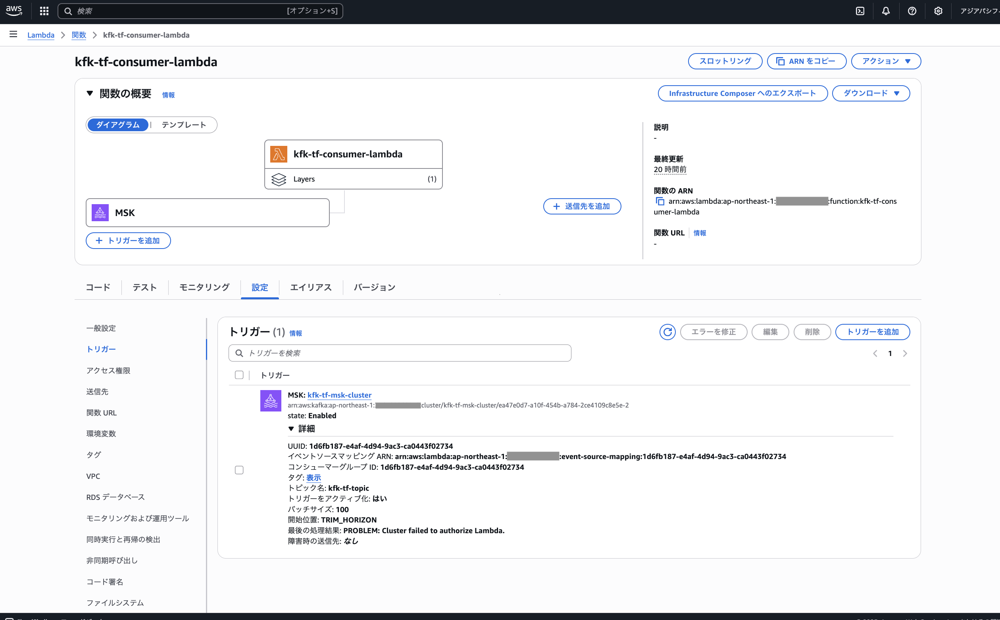

# kfk-tf
このリポジトリでは、[Amazon Managed Streaming for Apache Kafka (MSK)](https://aws.amazon.com/jp/msk/) にメッセージを送り、それを [AWS Lambda](https://aws.amazon.com/jp/lambda/) にイベントとして転送するシステムをテスト的に実装する。

1. S3　の入力バケットにメッセージとなるファイルをおくと、入力 Lambda を起動する
1. 入力Lamnbda は、そのファイル名、更新日時、ファイルの中身を保持するオブジェクトを Avro でシリアライズして MSK にメッセージとして送る
1. MSK ではメッセージをイベントソースマッピングにより出力 Lambda に転送する
1. 出力 Lambda はファイルの中身をS3　の出力バケットに置く


この仕組み全体を terraform で AWS へデプロイする。terraform には必要に応じて VPC の設定を含める。

## 断念

2025/8/26 以下の「最後の処理結果: PROBLEM: Cluster failed to authorize Lambda.」のエラーが取れず、断念した。



## 1. 環境設定

.devcontainer/devcontainer.json で開発コンテナを起動する。この開発コンテナでは続く操作に必要なツール類がインストールされている。
また、それぞれのファイルに編集に便利な VSCode の拡張モジュールや設定も含まれている。

## 2. AWS へのログイン

AWS へのログインは OTP を使用する。パラメータを環境変数に設定しておいて、以下のコマンドでログインする。

```sh
aws configure set --profile default-long-term aws_access_key_id $LONG_TERM_ACCESS_KEY_ID
aws configure set --profile default-long-term aws_secret_access_key $LONG_TERM_SECRET_ACCESS_KEY
aws-mfa --device $TF_VAR_MFA_SERIAL
```

## 3. terraform 初期化

以下のコマンドで terraform 初期化する。

```sh
terraform init
```

## 4. プランの確認

以下のコマンドでプランを確認する。

```sh
terraform plan
```

## 5. デプロイ

以下のコマンドでデプロイする。

```sh
terraform apply
```

## 6. 確認

AWS コンソールから S3　の入力バケットにメッセージとなるファイルをおく

